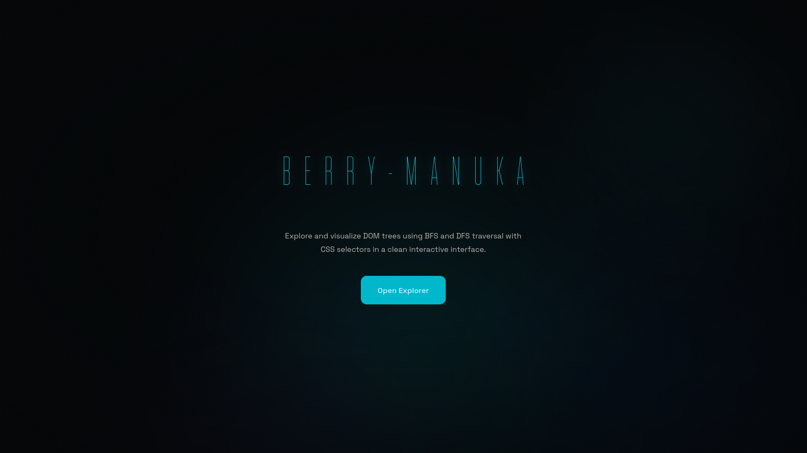

# Berry-Manuka

<p align="center">
  <strong>DOM Tree Explorer dengan Algoritma BFS dan DFS</strong><br>
  <em>Tugas Besar 2 IF2211 Strategi Algoritma</em><br>
  <em>Institut Teknologi Bandung Semester II 2025/2026</em>
</p>

<p align="center">
  
  
  
  
  
  
</p>

---

## Deskripsi Proyek

**Berry-Manuka** adalah aplikasi web interaktif untuk menelusuri dan memvisualisasikan pohon **Document Object Model (DOM)** menggunakan algoritma **Breadth-First Search (BFS)** dan **Depth-First Search (DFS)**. Aplikasi ini menerima input berupa URL website atau teks HTML mentah, memparse-nya menjadi struktur pohon DOM, dan melakukan penelusuran untuk menemukan elemen-elemen yang cocok dengan **CSS Selector** yang diberikan pengguna.

Proyek ini dikembangkan untuk memenuhi Tugas Besar 2 mata kuliah **IF2211 Strategi Algoritma** Program Studi Teknik Informatika, Sekolah Teknik Elektro dan Informatika, Institut Teknologi Bandung.

---

## Fitur

### Fitur Wajib

| Fitur | Deskripsi |
|-------|-----------|
| **Scraping HTML** | Mengambil konten HTML dari URL yang diberikan pengguna menggunakan `net/http` |
| **Parsing HTML** | Mengubah HTML mentah menjadi struktur pohon DOM dengan hierarki parent-child |
| **CSS Selector** | Mendukung tag (`div`), class (`.box`), ID (`#header`), universal (`*`), dan kombinator (`>`, ` `, `+`, `~`) |
| **Visualisasi Pohon** | Menampilkan pohon DOM secara interaktif dengan highlight node, zoom, dan navigasi |
| **Traversal BFS & DFS** | Penelusuran level-by-level (BFS) dan depth-first (DFS) dengan log tahapan |
| **Statistik Performa** | Menampilkan waktu eksekusi dan jumlah node yang dikunjungi |
| **Traversal Log** | Log terminal-style yang mencatat setiap tahapan penelusuran algoritma |
| **Node Inspector** | Klik node untuk melihat detail (ID, depth, parent, atribut, inner text) |
| **Result Limiting** | Pilihan menampilkan semua hasil atau membatasi ke Top-N kemunculan |

### Fitur Bonus

| Bonus | Poin | Status | Deskripsi |
|-------|------|--------|-----------|
| **Animasi Penelusuran** | 6 | ✅ | Play/Pause/Reset dengan kontrol kecepatan (100ms–1000ms). Node di-highlight secara real-time |
| **Multithreading** | 3 | ✅ | Toggle Parallel Mode: BFS/DFS paralel menggunakan goroutine dengan `sync.Mutex` dan `sync.WaitGroup` |
| **LCA Binary Lifting** | 3 | ✅ | Klik 2 node di pohon, backend menghitung Lowest Common Ancestor dengan preprocessing O(N log N) |
| **Docker** | 2 | ✅ | Multi-stage Dockerfile untuk frontend dan backend + `docker-compose.yml` |
| **Deploy Azure VM** | 5 | ✅ | Deployed di Microsoft Azure Virtual Machine dengan IP publik |

---

## 🛠️ Tech Stack

### Backend
| Teknologi | Versi | Kegunaan |
|-----------|-------|----------|
| **Go** | 1.25 | Bahasa pemrograman backend |
| `net/http` | Built-in | HTTP server dan routing |
| `golang.org/x/net/html` | v0.39.0 | HTML tokenizer untuk parsing |
| `sync` / `sync/atomic` | Built-in | Konkurensi dan counter thread-safe |

### Frontend
| Teknologi | Versi | Kegunaan |
|-----------|-------|----------|
| **Next.js** | 16.2.3 | React framework dengan App Router |
| **React** | 19.2.4 | Library UI |
| **TypeScript** | ^5 | Type safety |
| **Tailwind CSS** | ^4 | Utility-first styling |
| **shadcn/ui** | ^4.3.1 | Komponen UI primitives |
| **Framer Motion** | ^12.38.0 | Animasi dan micro-interactions |
| **Bun** | — | Package manager dan build tool |

### Deployment
| Teknologi | Kegunaan |
|-----------|----------|
| **Docker** | Containerization |
| **Docker Compose** | Orkestrasi multi-container |
| **Azure VM** | Cloud deployment |

---

## 🚀 Cara Menjalankan

### Prasyarat
- Go 1.25+
- Bun (atau Node.js 20+)
- Docker & Docker Compose (opsional)

### 1. Menjalankan Secara Lokal

#### Backend
```bash
cd backend
go mod download
go run main.go
```
Server berjalan di `http://localhost:8080`

#### Frontend
```bash
cd frontend
bun install
bun run dev
```
Aplikasi berjalan di `http://localhost:3000`

### 2. Menjalankan dengan Docker

Dari root project:
```bash
# Build dan jalankan semua service
docker compose up --build

# Atau background mode
docker compose up --build -d
```

| Service | URL |
|---------|-----|
| Frontend | `http://localhost:3000` |
| Backend API | `http://localhost:8080` |

### 3. Deployment Azure VM

Aplikasi telah di-deploy ke Microsoft Azure Virtual Machine:

| Akses | URL |
|-------|-----|
| Frontend | `http://40.81.27.55:3000` |
| Backend API | `http://40.81.27.55:8080` |

---

## API Endpoints

### `POST /api/scrape`
Menerima URL atau raw HTML dan mengembalikan parsed DOM tree.

**Request:**
```json
{
  "url": "https://example.com",
  "html": "<html><body><h1>Hello</h1></body></html>"
}
```

**Response:**
```json
{
  "tree": { /* DOMNode root */ },
  "totalNodes": 3,
  "maxDepth": 2
}
```

### `POST /api/traverse`
Melakukan penelusuran pohon DOM dengan algoritma pilihan.

**Request:**
```json
{
  "tree": { /* DOMNode root */ },
  "algorithm": "bfs",
  "selector": "div.active",
  "limit": 10
}
```

**Response:**
```json
{
  "matches": [ /* matched nodes */ ],
  "visitedNodes": 42,
  "executionTimeMs": 15,
  "logs": [ /* traversal steps */ ]
}
```

**Algoritma yang didukung:** `bfs`, `dfs`, `parallel_bfs`, `parallel_dfs`

### `POST /api/lca`
Menghitung Lowest Common Ancestor dari 2 node.

**Request:**
```json
{
  "tree": { /* DOMNode root */ },
  "nodeIdA": 5,
  "nodeIdB": 12
}
```

**Response:**
```json
{
  "lca": { /* LCA node */ },
  "pathA": [ /* path from root to node A */ ],
  "pathB": [ /* path from root to node B */ ]
}
```

---

## 📂 Struktur Repository

```
Tubes2_Berry-Manuka/
├── backend/
│   ├── Dockerfile              # Multi-stage Go build
│   ├── main.go                 # Entry point HTTP server
│   ├── go.mod                  # Go module definition
│   ├── handler/                # HTTP handlers (scrape, traverse, lca)
│   ├── model/                  # Struct DOMNode, Selector, TraversalResult
│   ├── parser/                 # HTML tokenizer → DOM tree
│   ├── scraper/                # HTTP fetch dengan validasi
│   ├── selector/               # CSS selector parser & matcher
│   ├── traversal/              # BFS, DFS, Parallel implementations
│   └── lca/                    # Binary Lifting LCA algorithm
│
├── frontend/
│   ├── Dockerfile              # Multi-stage Bun build
│   ├── next.config.ts          # Next.js config (standalone output)
│   ├── package.json            # Dependencies & scripts
│   ├── tailwind.config.ts      # Tailwind CSS configuration
│   ├── src/
│   │   ├── app/
│   │   │   ├── page.tsx        # Landing page
│   │   │   ├── explorer/
│   │   │   │   └── page.tsx    # Main application UI
│   │   │   └── layout.tsx      # Root layout
│   │   ├── components/
│   │   │   ├── ui/             # shadcn/ui components
│   │   │   ├── MeshBackground.tsx
│   │   │   ├── TextPressure.tsx
│   │   │   ├── MultithreadToggle.tsx
│   │   │   └── ...
│   │   └── lib/
│   │       ├── api.ts          # API client
│   │       └── types.ts        # TypeScript interfaces
│   └── public/                 # Static assets
│
├── docker-compose.yml          # Orchestrasi Docker
├── PRD_Tubes2_Detail.md        # Product Requirement Document
└── docs/                       # Dokumentasi dan laporan
```

---

## Landing Page
<p align="center">
  
</p>

---

## 👥 Tim Pengembang

| Nama | NIM | Kontribusi |
|------|-----|------------|
| **Agatha Tatianingseto** | 13524008 | Backend Development, Laporan |
| **Stefani Angeline Oroh** | 13524064 | Frontend Development, UI/UX Design |
| **Athilla Zaidan Zidna Fann** | 13524068 | Backend Development, DevOps & Deployment |

---

## 📚 Referensi

- [CSS Selector Reference — MDN](https://developer.mozilla.org/en-US/docs/Web/CSS/Guides/Selectors)
- [LCA Binary Lifting — CP-Algorithms](https://cp-algorithms.com/graph/lca_binary_lifting.html)
- [Go Documentation](https://go.dev/doc/)
- [Next.js Documentation](https://nextjs.org/docs)

